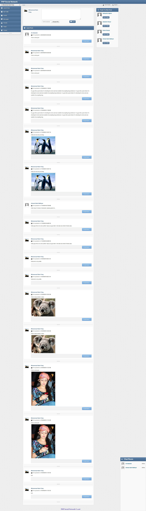
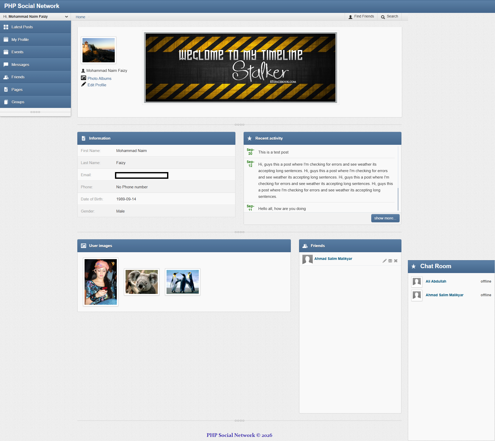
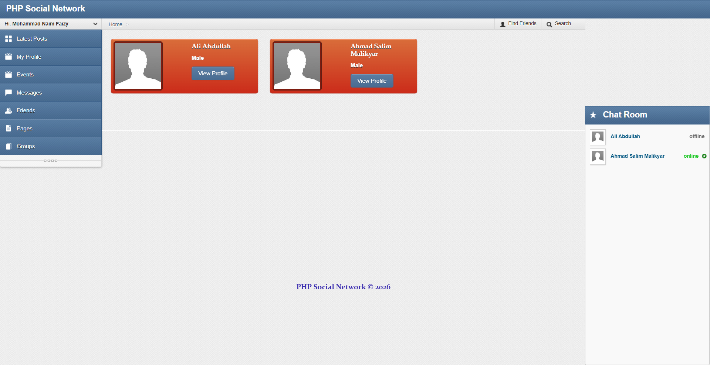
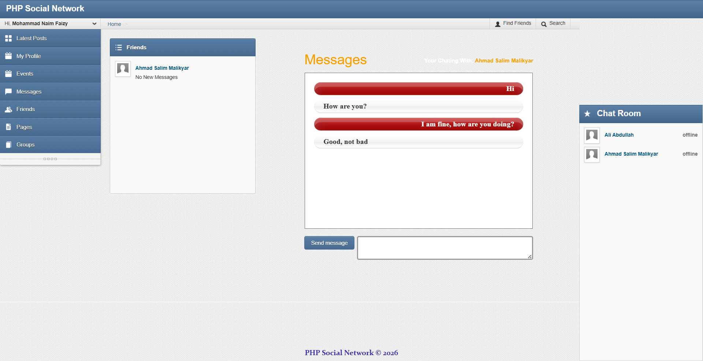
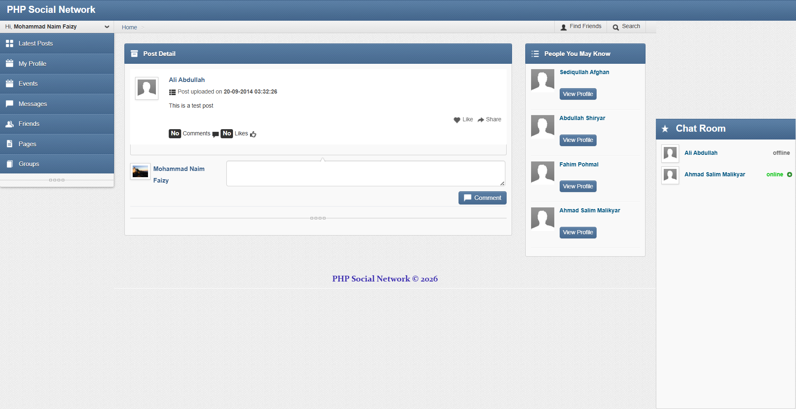

# PHP Social Network

A feature-rich social networking platform built with PHP and MySQL, originally developed in 2015 as part of a Web Design and Development course. This project demonstrates core social media functionality including user profiles, friend connections, messaging, posts, and photo sharing.


## 📋 Table of Contents

- [Features](#-features)
- [Screenshots](#-screenshots)
- [Technology Stack](#-technology-stack)
- [Project Structure](#-project-structure)
- [Installation](#-installation)
  - [Using Docker (Recommended)](#using-docker-recommended)
  - [Manual Installation](#manual-installation)
- [Configuration](#-configuration)
- [Database Schema](#-database-schema)
- [Usage](#-usage)
- [Default Credentials](#-default-credentials)
- [Development](#-development)
- [Known Limitations](#-known-limitations)
- [Contributing](#-contributing)
- [License](#-license)
- [Acknowledgments](#-acknowledgments)

## 🚀 Features

### Core Functionality

- **User Authentication**
  - User registration with email validation
  - Secure login system with MD5 password hashing
  - Session management
  - User status tracking (Active/Inactive)
  - Last online tracking

- **Profile Management**
  - Personal profile pages
  - Profile photo upload and management
  - Edit personal information (name, gender, date of birth, email, phone)
  - View other users' profiles

- **Social Networking**
  - **Friend System**
    - Send friend requests
    - Accept/reject friend requests
    - View friends list
    - Friend request notifications
  - **News Feed**
    - Create posts with text and images
    - View friends' posts
    - Like posts
    - Comment on posts
    - Real-time post updates

- **Messaging System**
  - Real-time chat functionality
  - Direct messaging between friends
  - Message read/unread status
  - Chat history
  - Message notifications

- **Photo Management**
  - Create photo albums
  - Upload multiple photos
  - Privacy settings (Public/Private)
  - Album cover photos
  - Photo viewer with fancybox integration

- **Search & Discovery**
  - Find friends by name
  - Advanced search functionality
  - User discovery

- **User Interface**
  - Responsive design with Bootstrap
  - Clean and intuitive interface
  - Real-time notifications
  - Breadcrumb navigation
  - Custom scrollbars

## 📸 Screenshots

### News Feed

The main feed page displaying posts from friends with like and comment functionality.


### User Profile

Personal profile page showing user information, posts, and photo albums.


### Friends Management

View and manage your friends list with options to connect with new people.


### Messaging System

Real-time messaging interface for chatting with friends.


### Post Details

Detailed view of individual posts with comments and interactions.


## 🛠 Technology Stack

### Backend

- **PHP 8.0** - Server-side programming language
- **MySQL** - Relational database management system
- **Apache** - Web server

### Frontend

- **HTML5 / CSS3** - Structure and styling
- **Bootstrap 2.x** - Responsive UI framework
- **jQuery** - JavaScript library for DOM manipulation
- **JavaScript** - Client-side scripting

### JavaScript Libraries & Plugins

- **CLEditor** - WYSIWYG HTML editor
- **elFinder** - File manager
- **Fancybox** - Lightbox for images
- **FullCalendar** - Calendar interface
- **DataTables** - Advanced table plugin
- **Select2** - Enhanced select boxes
- **Sparklines** - Inline charts
- **mCustomScrollbar** - Custom scrollbars
- **Plupload** - File upload handler
- **qTip** - Tooltips
- **jQuery Validation** - Form validation
- **jQuery Cookie** - Cookie management

### DevOps

- **Docker** - Containerization platform
- **Docker Compose** - Multi-container orchestration
- **phpMyAdmin** - Database management interface

## 📁 Project Structure

```
php-social-network/
├── css/                          # Stylesheets
│   ├── bootstrap.css            # Bootstrap framework
│   ├── style.css                # Main application styles
│   ├── login.css                # Login page styles
│   ├── icons.css                # Icon fonts
│   └── fancybox/                # Fancybox plugin styles
├── js/                           # JavaScript files
│   ├── actions.js               # Main application logic
│   ├── chat.js                  # Chat functionality
│   ├── mail.js                  # Messaging functions
│   ├── jquery.js                # jQuery library
│   └── plugins/                 # jQuery plugins
│       ├── bootstrap.min.js
│       ├── charts/              # Chart libraries
│       ├── cleditor/            # WYSIWYG editor
│       ├── dataTables/          # Table plugin
│       ├── fancybox/            # Lightbox plugin
│       └── ...
├── img/                          # Images and media
│   ├── users/                   # User profile photos
│   ├── backgrounds/             # Background images
│   ├── icons/                   # Icon sets
│   └── loaders/                 # Loading animations
├── includes/                     # PHP includes
│   ├── connection.php           # Database connection
│   ├── header.php               # Page header
│   ├── footer.php               # Page footer
│   ├── Navigation.php           # Navigation menu
│   ├── CheckStatus.php          # Session validation
│   ├── friendsRequest.php       # Friend requests component
│   ├── notifications.php        # Notifications component
│   ├── chatroom.php             # Chat component
│   └── MessagesFromFrieds.php   # Messages component
├── photo_albums/                 # User uploaded photos
├── php/                          # PHP utilities
│   ├── elfinder/                # File manager backend
│   └── pluploader/              # Upload handler
├── sql/                          # Database files
│   └── php_social_network.sql   # Database schema and seed data
├── index.php                     # Main dashboard/newsfeed
├── login.php                     # Login and registration
├── logout.php                    # Logout handler
├── user_profile.php              # User profile page
├── edit_profile.php              # Edit profile page
├── posts.php                     # Post details page
├── like_post.php                 # Like post handler
├── friends.php                   # Friends list page
├── find_friends.php              # Friend discovery page
├── messages.php                  # Messaging interface
├── message_send.php              # Message sending handler
├── photos.php                    # Photo albums page
├── search.php                    # Search functionality
├── advance_search.php            # Advanced search page
├── ajax.php                      # AJAX request handler
├── docker-compose.yml            # Docker orchestration
├── Dockerfile                    # PHP container definition
└── README.md                     # Project documentation
```

## 💻 Installation

### Using Docker (Recommended)

#### Prerequisites

- [Docker](https://www.docker.com/get-started) installed on your system
- [Docker Compose](https://docs.docker.com/compose/install/) installed
- Git (optional, for cloning)

#### Steps

1. **Clone or download the repository**

   ```bash
   git clone <repository-url>
   cd php-social-network
   ```

2. **Start the containers**

   ```bash
   docker compose up -d
   ```

   This will:
   - Build the PHP Apache container
   - Create a MySQL database container
   - Launch phpMyAdmin for database management
   - Automatically import the database schema
   - Set up networking between containers

3. **Access the application**
   - **Application**: http://localhost:9000
   - **phpMyAdmin**: http://localhost:8080
   - **MySQL Direct**: `localhost:33066`

4. **First-time setup**

   If the database wasn't automatically loaded (existing volumes), reset the database:

   ```bash
   docker compose down -v
   docker compose up -d
   ```

### Manual Installation

#### Prerequisites

- PHP 7.4 or higher (PHP 8.0+ recommended)
- MySQL 5.7 or higher
- Apache/Nginx web server
- phpMyAdmin (optional)

#### Steps

1. **Clone the repository**

   ```bash
   git clone <repository-url>
   cd php-social-network
   ```

2. **Configure web server**
   - Point your web server document root to the project directory
   - Ensure PHP extensions are enabled: `mysqli`, `gd`, `json`

3. **Create database**

   ```bash
   mysql -u root -p
   CREATE DATABASE php_social_network;
   ```

4. **Import database schema**

   ```bash
   mysql -u root -p php_social_network < sql/php_social_network.sql
   ```

5. **Configure database connection**

   Edit `includes/connection.php`:

   ```php
   define("DB_HOST", "localhost");
   define("DB_USERNAME", "root");
   define("DB_PASSWORD", "your_password");
   define("DB_DATABASE_NAME", "php_social_network");
   define("DB_PORT", 3306);
   ```

6. **Set permissions**

   ```bash
   chmod 755 img/users/
   chmod 755 photo_albums/
   ```

7. **Access the application**

   Navigate to `http://localhost/php-social-network` in your browser

## ⚙️ Configuration

### Docker Configuration

The Docker setup includes three services defined in `docker-compose.yml`:

- **php_social_network** (Port 9000)
  - PHP 8.0 with Apache
  - MySQLi extension enabled
  - Volume mounted to project directory

- **php_social_network_db** (Port 33066)
  - MySQL database
  - Auto-loads SQL file on first run
  - Persistent data storage

- **phpmyadmin** (Port 8080)
  - Web-based database management
  - Pre-configured with database credentials

### Database Configuration

**Connection Settings** (for Docker):

```php
Host: php_social_network_db  // Service name for internal communication
Port: 3306                    // Internal container port
Username: root
Password: Kabul@123
Database: php_social_network
```

**External Access** (from host machine):

```
Host: localhost
Port: 33066
Username: root / admin
Password: Kabul@123
```

### Environment Variables

Modify `docker-compose.yml` to change:

- `MYSQL_ROOT_PASSWORD` - Root password
- `MYSQL_DATABASE` - Database name
- `MYSQL_USER` - MySQL user
- `MYSQL_PASSWORD` - User password

## 🗄 Database Schema

The application uses 10 database tables:

### Tables Overview

| Table         | Description                       |
| ------------- | --------------------------------- |
| `users`       | User accounts and profiles        |
| `posts`       | User posts/status updates         |
| `comments`    | Comments on posts                 |
| `like_post`   | Post likes tracking               |
| `friends`     | Friend relationships and requests |
| `message`     | Direct messages between users     |
| `files`       | Uploaded files metadata           |
| `photos`      | Photo gallery images              |
| `photo_album` | Photo albums                      |

### Key Tables

**users**

- `user_ID` (Primary Key)
- `first_name`, `last_name`
- `email`, `phone`
- `password` (MD5 hashed)
- `gender`, `dob`
- `profile_photo`
- `user_status` (Active/Inactive)
- `LastOnline`

**posts**

- `post_id` (Primary Key)
- `member_id` (Foreign Key → users)
- `post_time`
- `post_content`

**friends**

- `friends_ID` (Primary Key)
- `requestedMemberID` (Foreign Key → users)
- `toMemberID` (Foreign Key → users)
- `RequestedDate`
- `Status` (Pending/Accepted/Rejected)

**message**

- `message_id` (Primary Key)
- `from_user_id` (Foreign Key → users)
- `to_user_id` (Foreign Key → users)
- `message_text`
- `Status` (Read/Unread)
- `message_date`

## 📖 Usage

### User Registration

1. Navigate to http://localhost:9000
2. Click on "Sign Up"
3. Fill in the registration form:
   - First Name & Last Name
   - Email (used as username)
   - Password
   - Gender
   - Date of Birth
4. Click "Create Account"

### Creating Posts

1. Log in to your account
2. On the dashboard, locate the post creation area
3. Type your status or message
4. (Optional) Upload an image using the file upload button
5. Click "Post" or "Share"

### Adding Friends

1. Navigate to "Find Friends"
2. Search for users by name
3. Click "Add Friend" on user profiles
4. Wait for them to accept your request
5. View your friends in the "Friends" section

### Sending Messages

1. Go to "Messages"
2. Select a friend from your friends list
3. Type your message in the chat box
4. Press Enter or click Send
5. Messages update in real-time

### Creating Photo Albums

1. Navigate to "Photos"
2. Click "Create Album"
3. Enter album title
4. Choose privacy setting (Public/Private)
5. Upload a cover photo
6. Add photos to the album

## 🔑 Default Credentials

The database comes with pre-populated test users. You can log in with:

**User 1:**

- Email: `mnaim.faizy@gmail.com`
- Password: `password`

**User 2:**

- Email: `ali@yahoo.com`
- Password: `password`

**User 3:**

- Email: `salim.malikyar@gmail.com`
- Password: `password`

> **Note**: All passwords are MD5 hashed as `5f4dcc3b5aa765d61d8327deb882cf99` (which is "password")

## 🔧 Development

### Prerequisites

- Basic understanding of PHP and MySQL
- Familiarity with jQuery and Bootstrap
- Docker knowledge (for containerized development)

### Running in Development Mode

1. **Start containers with logs**

   ```bash
   docker compose up
   ```

2. **View logs**

   ```bash
   docker compose logs -f php_social_network
   docker compose logs -f php_social_network_db
   ```

3. **Restart services**

   ```bash
   docker compose restart
   ```

4. **Stop services**

   ```bash
   docker compose down
   ```

5. **Access database**
   - Via phpMyAdmin: http://localhost:8080
   - Via CLI:
     ```bash
     docker exec -it php_social_network_db mysql -uroot -pKabul@123 php_social_network
     ```

### Code Modifications

- PHP files are volume-mounted, changes reflect immediately
- CSS/JS changes are also instant (refresh browser)
- Database changes require SQL execution via phpMyAdmin or CLI

### Adding New Features

1. Create necessary database tables/columns
2. Create PHP backend logic
3. Update includes if needed (navigation, header, etc.)
4. Create frontend interface
5. Add AJAX handlers if required
6. Test thoroughly

## ⚠️ Known Limitations

### Security Considerations

> **IMPORTANT**: This application was developed in 2015 as an educational project and contains several security vulnerabilities that should be addressed before any production use:

- **SQL Injection**: Direct SQL queries without prepared statements
- **Weak Password Hashing**: Uses MD5 instead of bcrypt/Argon2
- **XSS Vulnerabilities**: Limited input sanitization
- **CSRF Protection**: No CSRF tokens implemented
- **File Upload Security**: Limited file type validation
- **Session Security**: Basic session management

### Recommendations for Production

If you plan to use this in a production environment:

1. **Implement Prepared Statements**

   ```php
   // Instead of:
   $query = "SELECT * FROM users WHERE email='$email'";

   // Use:
   $stmt = $conn->prepare("SELECT * FROM users WHERE email=?");
   $stmt->bind_param("s", $email);
   ```

2. **Upgrade Password Hashing**

   ```php
   // Replace MD5 with:
   $hashed_password = password_hash($password, PASSWORD_ARGON2ID);
   password_verify($password, $hashed_password);
   ```

3. **Add Input Validation & Sanitization**

   ```php
   $clean_input = htmlspecialchars(strip_tags($user_input), ENT_QUOTES, 'UTF-8');
   ```

4. **Implement CSRF Protection**
5. **Add HTTPS/SSL support**
6. **Validate and sanitize file uploads**
7. **Add rate limiting**
8. **Implement proper error handling**

### Functional Limitations

- No email verification system
- Limited search functionality
- Basic notification system
- No post editing feature
- Limited privacy controls
- No content moderation tools

## 🤝 Contributing

This is an educational project from 2015. While it's not actively maintained, contributions are welcome:

1. Fork the repository
2. Create a feature branch (`git checkout -b feature/improvement`)
3. Make your changes
4. Commit your changes (`git commit -am 'Add new feature'`)
5. Push to the branch (`git push origin feature/improvement`)
6. Create a Pull Request

### Areas for Improvement

- Security enhancements (see Known Limitations)
- Modern PHP practices (namespaces, autoloading, PDO)
- Frontend modernization (Bootstrap 5, Vue.js/React)
- RESTful API implementation
- Unit testing
- Code documentation
- Accessibility improvements
- Mobile app integration

## 📄 License

This project is licensed under the Apache License 2.0 - see the [LICENSE](LICENSE) file for details.

## 🙏 Acknowledgments

- **Course**: Web Design and Development (2015)
- **Framework**: Bootstrap for responsive design
- **Icons**: Various icon sets included in the project
- **Plugins**: jQuery plugin community
- **Inspiration**: Early social networking platforms

---

## 📞 Support

If you have questions or issues:

1. Check existing documentation
2. Review the code comments
3. Open an issue in the repository
4. Refer to the original course materials (if available)

## 🌟 Project History

This project was created in **2015** as part of a **Web Design and Development** course. It represents the state of web development practices and technologies from that era. The Docker integration was added later to modernize deployment and make it easier to run.

### Historical Context

- **PHP Version**: Originally developed for PHP 5.x
- **Bootstrap**: Uses Bootstrap 2.x (now upgraded in many projects)
- **jQuery**: Heavily jQuery-dependent (common practice in 2015)
- **Security**: Reflects 2015 security practices (needs modernization)

---

**Note**: This is an educational project and should be used for learning purposes. For production use, significant security improvements are required.
